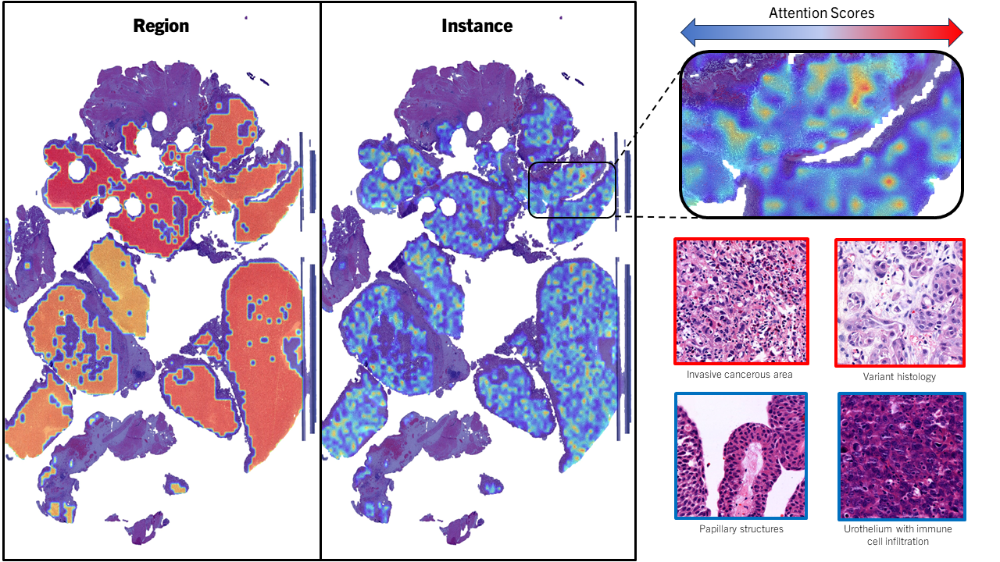

# HistoBCG

This is the source code described in the paper "Histopathological Deep Learning-Based BCG Treatment Response Prediction" by Saul Fuster, Farbod Khoraminia, Julio Silva, Trygve Eftestøl, Valery Naranjo, Tahlita C.M. Zuiverloon, and Kjersti Engan - under revision.

### 1 - Abstract
We present a systematic study of technical solutions using deep learning and histopathological images to predict Bacillus Calmette–Guérin (BCG) response in high-risk muscle-invasive bladder cancers (HR-NMIBC) patients. We investigated various regions of interest within the slides and explored different learning scenarios. The study did not find a satisfactory solution using the available resources. The authors suggest that future studies should explore alternative approaches to address this challenge. Despite the challenges faced, this study provides important insights into the complexity of predicting BCG response in HR-NMIBC patients, and highlights the need for continued research in this area.

<p align="center">
    
</p>

### 2 - How to use

This codebase implements a two-part framework for image analysis: a contrastive learning module for feature extraction and a nested Multiple Instance Learning (MIL) classification module. The system offers the flexibility to use feature embeddings alone, clinicopathological data, or a combination of both for image classification tasks.

**Contrastive Learning Module:**
- The `main_XXX.py` scripts contain the implementation of a contrastive learning algorithm for training a convolutional neural network (CNN) backbone. Use `main_monoscale.py` and `main_multiscale.py` for single or tri-scale magnification inputs, respectively.
- The network is trained to generate feature embeddings for input images by maximizing the similarity between positive pairs and minimizing the similarity between negative pairs.
- You can configure the network architecture, loss function, and training hyperparameters in the script.
- Pre-trained models can be saved and loaded for feature extraction. Also, feature embeddings are generated for posterior classification training.

**Classification Module:**
- The `main_nmil.py` script builds a nested MIL classification model.
- It uses feature embeddings from the contrastive learning module, clinicopathological data, or both for image classification.
- The nested MIL approach hierarchically combines information from image regions (bags) to make a final classification decision.
- The script provides options for configuring the classifier architecture, handling multi-modal data, and specifying MIL pooling techniques.
- You can easily switch between using feature embeddings, clinicopathological data, or a combination as input.

**Usage:**
- Use the `main_XXX.py` script to train the contrastive learning module on your dataset. Provide data loaders and adjust training settings as needed.
- After feature extraction, you can use the `main_nmil.py` script to train the nested MIL classifier. Specify the input data sources and adjust the model architecture according to your requirements.
- The `inference.py` script allows you to perform inference on new images using the trained classification model.
- The `logistic_regression.py` script provides performance insights on the trained classification model.

**Dependencies:**
- Ensure that you have the required dependencies listed in the `requirements.txt` file.

<p align="center">
    
</p>

### 3 - Link to paper
TBA

### 4 - How to cite our work
The code is released free of charge as open-source software under the GPL-3.0 License. Please cite our paper if you use it in your research.
```
TBA
```
